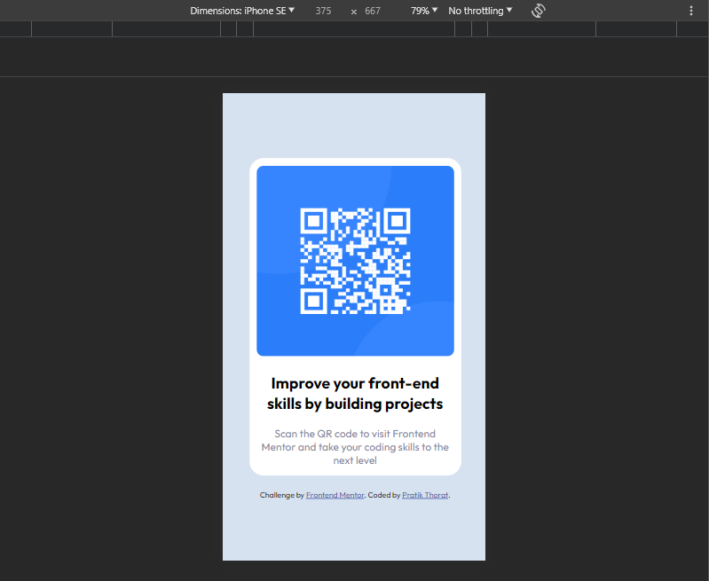
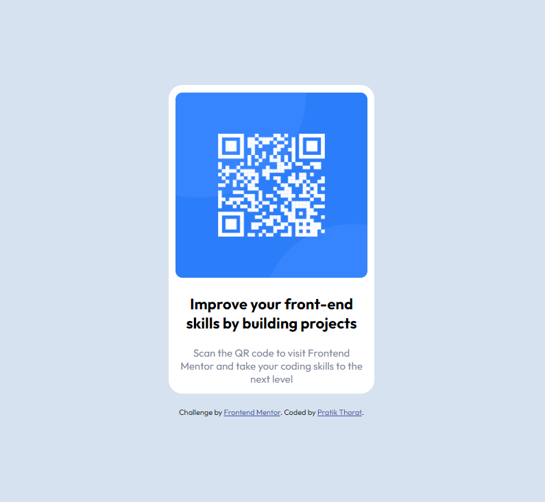

# Frontend Mentor - QR code component solution

This is a solution to the [QR code component challenge on Frontend Mentor](https://www.frontendmentor.io/challenges/qr-code-component-iux_sIO_H). Frontend Mentor challenges help you improve your coding skills by building realistic projects.

## Table of contents

- [Overview](#overview)
  - [Screenshot](#screenshot)
  - [Links](#links)
- [My process](#my-process)
  - [Built with](#built-with)
  - [What I learned](#what-i-learned)
  - [Continued development](#continued-development)
- [Author](#author)

## Overview

This was my first ever frontend mentor challenge. I used this challenge to brush up my HTML and CSS knowledge. Although the design itself was seemingly easy but getting a pixel perfect design was tough. I used a bunch of basic CSS techniques. Explained [Here](#my-process)

### Screenshot




### Links

- Solution URL: [Code](https://github.com/PratikThoratNortheastern/Frontend-Mentor---QR-code-component-solution)
- Live Site URL: [View live site](https://pratikthoratnortheastern.github.io/Frontend-Mentor---QR-code-component-solution/)

## My process

The very first thing I did was to first look at the design carefully and check for nuances if any. For example, in this case the design has a card within which there is a bunch of text and a QR Code image around it.

Although they may look like a unit (Which at the end they are) I decided to divide the component into 4 different components:

- Outer Card
- QR Image
- Bold bigger text
- Thin Smaller text.

Doing this helped in structutring the HTML appropriately 🤗. After that I decided on the basic styling on the components and then used flexbox majorly to position everything.

### Built with

- Semantic HTML5 markup
- CSS
- Flexbox

### What I learned

I was able to brush up on the basics of Flexbox and I was able to acheieve a mobile first and pixel perfect result fairly quickly.

```css
.qr-container {
  border-radius: 20px;
  display: flex;
  gap: 20px;
  align-items: center;
  justify-content: center;
  flex-direction: column;
  height: 450px;
  width: 300px;
  padding: 15px;
  background-color: hsl(0, 0%, 100%);
}
```

### Continued development

Next time I will focus on using units other than px since they practically destroy the natural responsiveness of HTML.

## Author

- Website - [Pratik Thorat](https://www.your-site.com)
- Frontend Mentor - [@PratikThoratNortheastern](https://www.frontendmentor.io/profile/PratikThoratNortheastern)
- Twitter - [@iamafrontendeng](https://twitter.com/iamafrontendeng)
